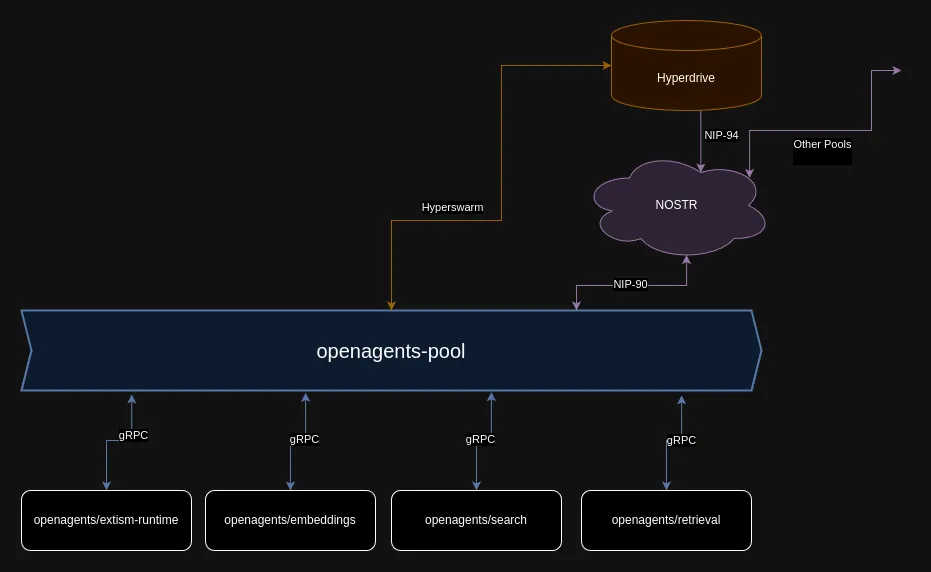

# OpenAgents - pool

A distributed [NIP-90](https://github.com/nostr-protocol/nips/blob/master/90.md) service provider.



Several nodes, each supporting one or more job kinds, can connect to the pool and offer their services to the network.
The pool assigns and orchestrates jobs to the nodes, and provides an unified interface for intercommunication, data storage and caching.

The services provided by the pool are:
- Job assignment: the nodes can ask the pool for jobs they can complete
- Decentralized storage: the pool provides apis for hyperdrive based binary storage, nodes have access to a distributed multi-writer p2p filesystem
- Caching: the pool provides apis for caching data (p2p on top of hyperdrive).
- Intercommunication: the pool provides apis for nodes to communicate with each other or with other pools
- Job orchestration: the pool provides apis for logging and sending job status updates
- Discovery: the pool provides apis for nodes to discover other nodes, pools and services


Pools can be self-hosted and are interconnected, every node and user can request jobs from any pool. 

It is possible to enforce the use of a pool by setting the service provider pub key in the "p" tag as explained in the [NIP-90](https://github.com/nostr-protocol/nips/blob/master/90.md), it is also possible to encrypt the payload for pool pub key by following the nip-90 spec.

When a job is encrypted for a specific pool it will be available only to the nodes directly connected to it.
When a job is enforced to a specific pool, said pool should be the only one to resolve it, and the connected nodes should be discouraged from firing subjobs for nodes outside the pool, to avoid the risk of leaking sensitive data to untrusted pools.

Every pool is tasked with the responsability of vetting the nodes that connect to it and should provide a encompassing terms of service and privacy policy for the end users.

The end users chose which pools to use and ultimately which pool operators to trust.

Build and debug

```
npm run debug
```

Run UI (gRPC web ui)

```
npm run ui
```